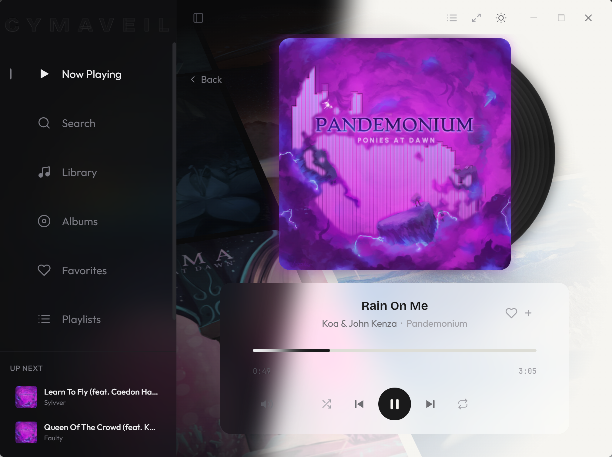
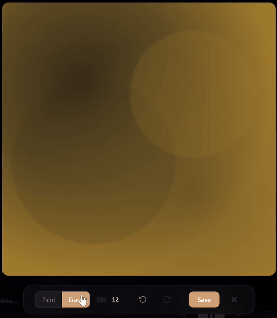

# Cymaveil

> **AI Disclosure** — Cymaveil was built with heavy use of AI assistance — specifically [Claude](https://claude.ai) by Anthropic, via [Claude Code](https://claude.com/claude-code). Architecture decisions, implementation, debugging, and even this README were shaped through collaborative human–AI development. The project reflects genuine creative intent and hands-on direction, but it would be dishonest not to acknowledge how much of the heavy lifting was done by an LLM.

> **Status** — Cymaveil is still early. It hasn't been battle-tested beyond a single developer's library, and performance was not a primary consideration — form over function was the guiding principle. That said, we're genuinely proud of where it's at. If something catches your eye or you want to make it better, the door's open — [CONTRIBUTING.md](CONTRIBUTING.md).

A refined desktop music player with living album art.

Cymaveil turns your local music library into a visual experience — album artwork drives dynamic backgrounds, color palettes, and audio-reactive visualizations that respond to whatever you're listening to. An on-device depth model can even separate album art into layers, so the visualizer plays *behind* the subject — and of course, there's no replacement for the human touch — you can paint your own masks too.

*Content in screenshots used with permission from Ponies at Dawn, check out their Bandcamp at [https://poniesatdawn.bandcamp.com/music](https://poniesatdawn.bandcamp.com/music)*



*The Now Playing view across themes — album artwork drives dynamic backgrounds, color palettes, and audio-reactive visualizations.*



*The built-in brush editor — paint your own depth masks when the ML model doesn't get it right, or for artwork where you want full creative control over what sits in front of the visualizer.*

## Features

- **Living album art** — dynamic mosaic backgrounds driven by your album artwork, with multiple tile transition styles (3D flip, shrink/grow, cross-fade, iris wipe, and more)
- **Audio-reactive visualizer** — real-time waveform and frequency visualization powered by Web Audio API
- **Depth layer decomposition** — on-device ML separates album art into foreground and background layers so the visualizer plays *behind* the subject, or paint your own masks with the fullscreen brush editor (off by default — enable in Settings → Depth Layers)
- **Library scanning** — point it at your music folders and it indexes metadata, artwork, and album structure automatically
- **Virtualized track lists** — smooth scrolling through large libraries with alphabetical quick-nav
- **Playlists** — create, edit, and manage playlists with M3U8 import/export
- **Queue management** — shuffle, repeat, and see what's coming next
- **Album view** — browse by album with grid layout and detail pages
- **Search** — filter across tracks, albums, and artists
- **Now Playing view** — full-screen player with album art, visualizer, and playback controls; press F11 for immersive fullscreen that hides all chrome
- **Mini player** — compact controls that stay out of the way while browsing
- **Dark & light themes** — system-aware with manual toggle
- **Media key support** — play/pause, next, previous via keyboard and OS media controls
- **File watching** — library updates automatically when files change on disk

## Language Support

Cymaveil is currently English-only with no internationalization (i18n) infrastructure. If you'd like to see support for your language or want to help contribute translations, [open an issue](https://github.com/justmediocre/cymaveil/issues).

## Download

Download the latest release for Windows, macOS, and Linux from the [v0.1.0 release page](https://github.com/justmediocre/cymaveil/releases/tag/v0.1.0).

> **Note — Unsigned binaries:** Cymaveil is not code-signed. On Windows you'll see a SmartScreen warning ("Windows protected your PC"), and on macOS Gatekeeper will block the app by default. This is normal for independent open-source software — you can bypass SmartScreen by clicking "More info" → "Run anyway", or on macOS by right-clicking the app and selecting "Open". We'd love to sign releases eventually, but code-signing certificates aren't free and this is a hobby project.

## Why "Cymaveil"?

The name is a portmanteau of **cyma** — from the Greek *κῦμα* (kyma), meaning "wave," as in *cymatics*, the study of visible sound patterns — and **veil**, the translucent layer that sits over your album art. The depth-segmented foreground mask, the audio-reactive visualizer — they're semi-transparent veils draped over the artwork, revealing and concealing in response to the music.

**Cymaveil** ≈ *a wave-veil* — sound waves made into a visual layer that lives on top of your album art.

## Getting Started

### Prerequisites

- [Node.js](https://nodejs.org/) 18+
- npm (comes with Node.js)

### Install

```bash
git clone https://github.com/justmediocre/cymaveil.git
cd cymaveil
npm install
```

### Development

```bash
npm run electron:dev
```

This starts the Vite dev server and launches Electron with hot reload.

### Build

```bash
# Type-check and build the renderer
npm run build

# Package for Windows (NSIS installer + portable)
npm run dist

# Package for Linux (AppImage + deb)
npm run dist:linux

# Package for macOS (DMG)
npm run dist:mac

# Package for Windows + Linux together
npm run dist:all
```

Built output goes to `release/`.

Want to contribute? See [CONTRIBUTING.md](CONTRIBUTING.md) for guidelines and the full list of dev commands.

## Tech Stack

- **Electron** 40 — desktop shell
- **React** 19 + **TypeScript** 5.9 — UI
- **Vite** 7 — bundler with HMR
- **Tailwind CSS** 4 — styling
- **Framer Motion** (motion/react) — animations
- **Web Audio API** — visualizer and audio analysis
- **@tanstack/react-virtual** — virtualized lists
- **@huggingface/transformers** — on-device depth estimation (Depth Anything v2) for album art decomposition
- **@fontsource-variable** — self-hosted variable fonts (Outfit, Bricolage Grotesque, JetBrains Mono)

## License

[MIT](LICENSE)
